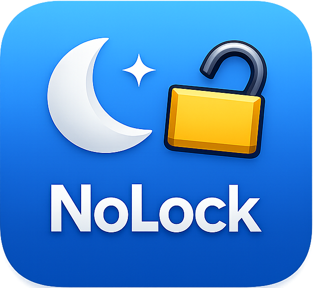

# NoLock



NoLock is a simple macOS SwiftUI app that prevents display sleep and idle system sleep while enabled.

## Features

- Main GUI window with an on/off toggle
- Menu bar item with on/off toggle and status
- `Show Window` action from the menu bar menu

## Requirements

- macOS 13+
- Swift 6 toolchain

## Run locally

```bash
swift run
```

## Build artifacts with Make

```bash
make binary   # builds dist/NoLock
make app      # builds dist/NoLock.app
make all      # builds both
```

The app icon is read from `assets/icon.png` during `make app`.
